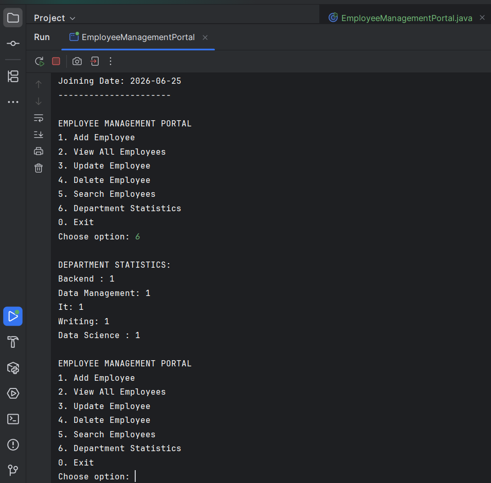

# Employee Management System - README

## Overview
This is a Java-based Employee Management System that uses MongoDB for data storage. The system provides functionality to manage employee records including adding, viewing, updating, deleting, and searching employees, as well as generating department statistics.

## System Screenshots

### 1. Main Menu Interface

*The main menu of the Employee Management Portal showing available options*

### 2. Employee Search Functionality

*Searching for an employee by name and viewing the results*

### 3. Department Statistics

*Viewing department-wise employee count statistics*

### 4. MongoDB Database View

*Direct view of the MongoDB employees collection showing stored documents*

## System Components

### 1. Employee.java
- Defines the Employee entity with fields:
  - id (String)
  - name (String)
  - email (String)
  - department (String)
  - skills (List<String>)
  - joiningDate (Date)
- Includes constructors, getters, and setters

### 2. EmployeeManagementPortal.java
- Main console application for employee management
- Features:
  - Add new employees
  - View all employees
  - Update employee information
  - Delete employees
  - Search employees by various criteria
  - View department statistics
- Uses MongoDB for data persistence

### 3. EmployeeService.java
- Service layer that handles business logic and database operations
- Methods include:
  - CRUD operations for employees
  - Search functionality by name, department, skill, or date range
  - Department statistics aggregation
  - Sorting employees by field

### 4. MongoDBConnection.java
- Handles MongoDB connection management
- Provides a singleton database connection
- Configurable connection string and database name

## Prerequisites

- Java JDK 8 or later
- MongoDB server running locally (default: mongodb://localhost:27017)
- MongoDB Java Driver (included in project dependencies)

## Installation

1. Clone the repository:
   ```bash
   git clone https://github.com/your-repo/employee-management-system.git
   ```

2. Ensure MongoDB is running on your local machine (default port 27017)

3. Compile the Java files:
   ```bash
   javac -cp ".:mongodb-driver-sync-4.0.5.jar" *.java
   ```

4. Run the application:
   ```bash
   java -cp ".:mongodb-driver-sync-4.0.5.jar" EmployeeManagementPortal
   ```

## Usage

### Running the Console Application
1. Start the `EmployeeManagementPortal` class
2. Use the menu options to perform various operations:
   ```
   EMPLOYEE MANAGEMENT PORTAL
   1. Add Employee
   2. View All Employees
   3. Update Employee
   4. Delete Employee
   5. Search Employees
   6. Department Statistics
   0. Exit
   ```

### Using the Service Layer
The `EmployeeService` class can be used programmatically:
```java
EmployeeService service = new EmployeeService();

// Add an employee
Employee emp = new Employee("John Doe", "john@example.com", "IT", 
                          Arrays.asList("Java", "SQL"), new Date());
String id = service.addEmployee(emp);

// Search employees
List<Employee> itEmployees = service.searchByDepartment("IT");

// Get statistics
List<Document> stats = service.getDepartmentStatistics();
```

## Database Schema
The system uses MongoDB with the following document structure:
```json
{
  "_id": ObjectId,
  "name": String,
  "email": String,
  "department": String,
  "skills": [String],
  "joiningDate": Date
}
```

## Configuration
- MongoDB connection settings can be modified in `MongoDBConnection.java`
- The database name is set to "employee_db" by default

## Dependencies
- MongoDB Java Driver (version 4.0.5 or compatible)

## License
This project is open-source and available under the MIT License.


